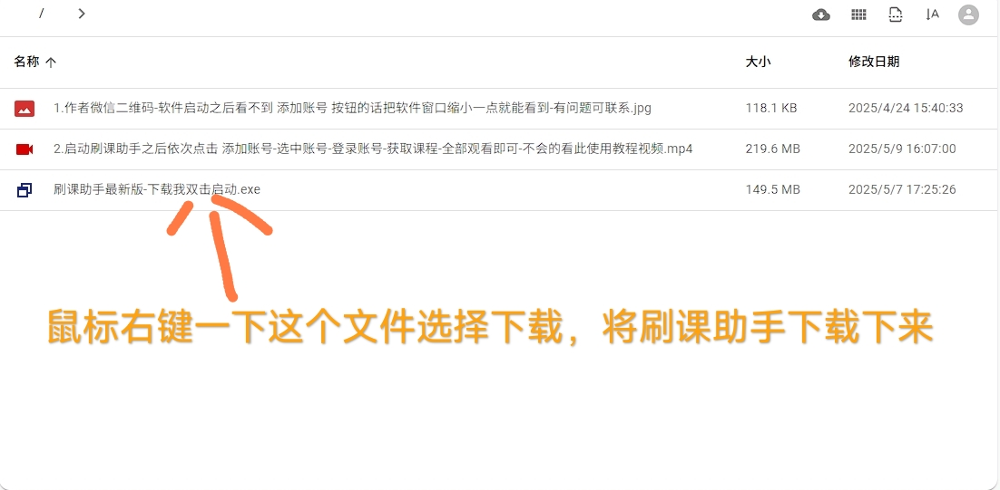
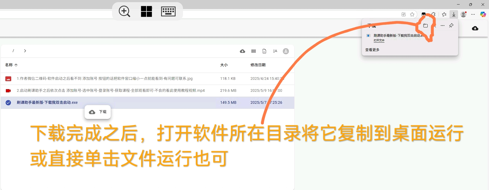
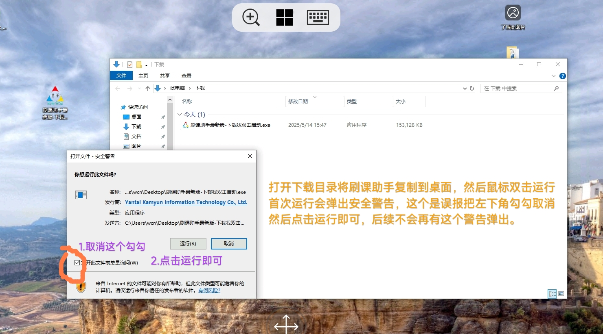
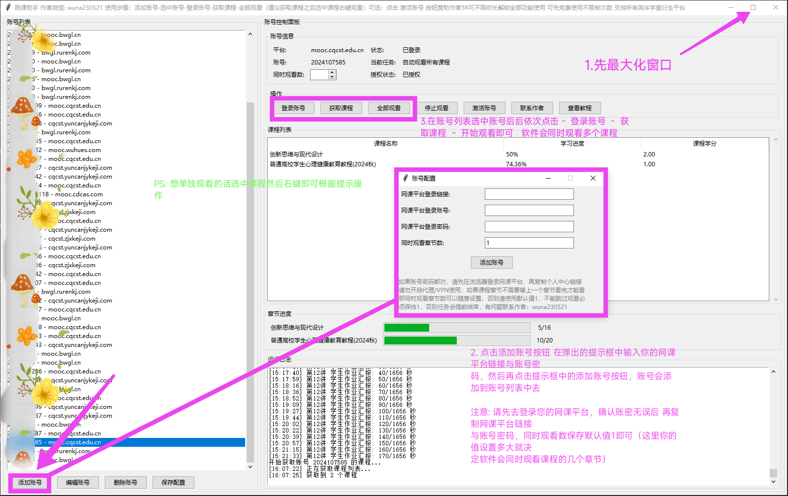

# **刷课助手操作指南**

**作者微信：wuna230521**  

**下载链接: [https://skzs.online/](https://skzs.online/)**  

---

## **1. 软件概述**  
刷课助手是一款利用Python语言开发的自动化网课观看工具，致力于帮助用户高效地完成课程观看任务，从而节省宝贵时间。软件不需要打开浏览器加载视频，只需在后台运行本软件即可。  

---

## **2. 软件下载与安装**  
1. 通过提供的下载链接，下载 `刷课助手最新版.exe` 文件至您的电脑。  
   - 下载链接: [点击我前往下载](https://skzs.online)  
   -   

2. 将下载的文件放置于电脑中的指定文件夹，以便于后续的操作和使用。  
   -   

---

## **3. 软件启动步骤**  
1. 双击 `刷课助手最新版.exe` 文件，启动程序。  
   -   

2. 按照屏幕提示完成基本设置，例如调整观看速度等。  
   -   

---

## **4. 网课账号添加流程**  
1. 在软件界面输入您的网课平台网址。  
2. 输入您的账号信息（用户名和密码），点击弹窗中的“添加账号”按钮。  
3. “同时观看数”默认值为1，可根据需求修改（若课程无需顺序观看）。  

---

## **5. 课程获取与自动观看操作**  
1. 成功登录账号后，软件将自动检索并显示课程列表。  
2. 选择需要观看的课程，点击 **“开始刷课”** 按钮。  
3. 软件将自动模拟观看，并实时跟踪课程进度。  

---

## **6. 高级功能介绍**  
- **批量观看**：支持多课程同时观看，提升学习效率。  
- **进度调节**：可根据个人需求调整观看速度。  

---

## **7. 常见问题解答**  
**Q：软件启动失败怎么办？**  
> A：关闭微软安全中心或其他杀毒软件防止误报，或将其添加到白名单。  

**Q：观看进度未同步？**  
> A：点击“获取课程”显示实时进度，或尝试重新登录账号。  

**Q：提示登录超时请重新登录？**  
> A：英华学堂每天凌晨自动踢下线账号，需重新登录并开始任务。  

---

## **8. 结语**  
刷课助手致力于提升用户的学习效率。若遇到问题，欢迎反馈改进建议！  
