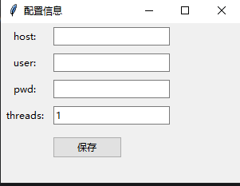
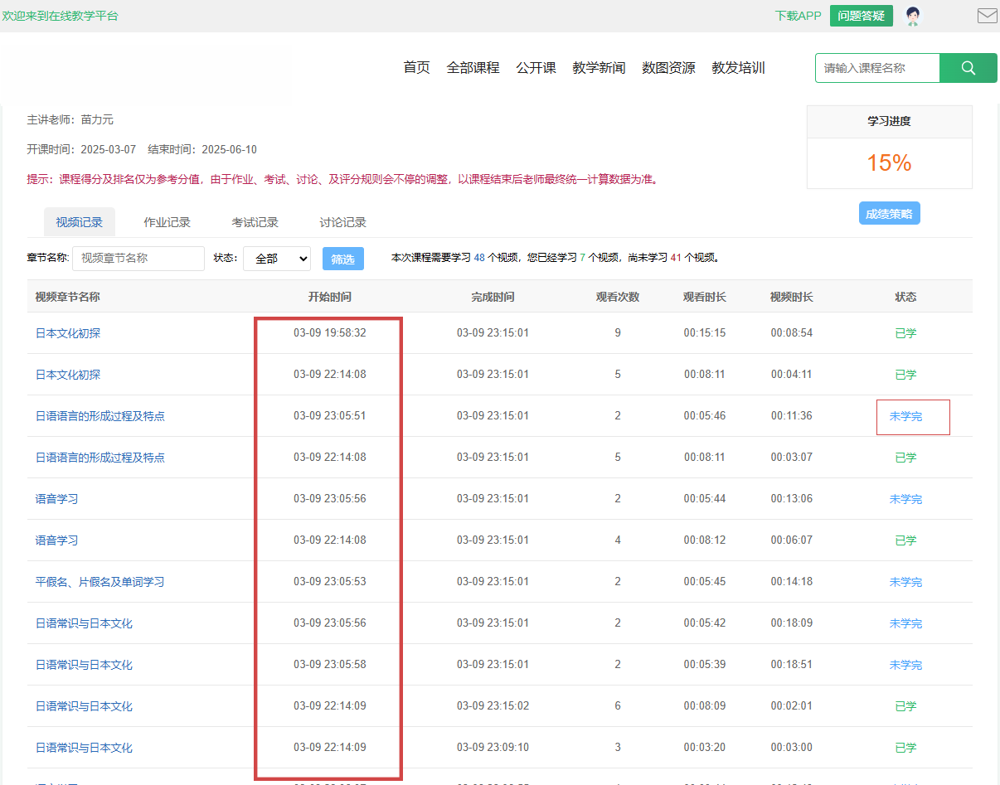
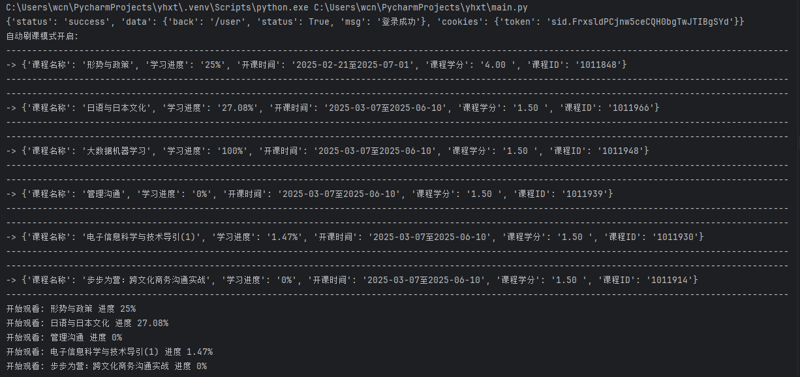
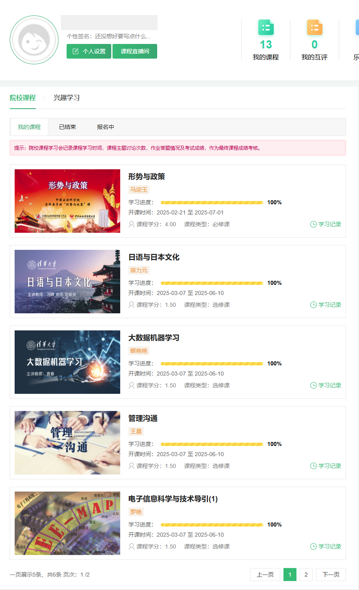

# 本项目利用JS逆向工程获取加密参数sign，实现自动、多线程的验证码绕过播放，无需浏览器插件。通过分析网站JS文件并移除检测机制，确保安全稳定，避免插件暂停检测。线程数可选，支持单线程慢刷，并自动播放所有课程、智能识别验证码，10分钟内完成课程。

## 使用教程：
    本Python项目跨平台支持安卓手机、苹果电脑、Windows电脑、iPad、Linux。

    下载 skzs-bate.exe 程序，设置 host（网课登录地址）、user（账号）、pwd（密码）以及 threads（线程数，默认为1，超过1进入奔放模式，建议不超过20）。

##  Pro 版本（联系作者 wx：wuna230521）可实现秒速完成课程、多账号同时观看、自动填写答案等高级功能。

告别付费刷课插件和代刷服务。本项目完全免费，所有信息本地存储，避免信息泄露风险。源码开源，安全可靠。
## 支持学校：
清华大学 Tsinghua University
北京大学 Peking University
北京师范大学 Beijing Normal University
国防科技大学 National University of Defense Technology
西安交通大学 Xi'an Jiaotong University
哈尔滨工业大学 Harbin Institute of Technology
华南理工大学 South China University of Technology
南开大学 Nankai University
复旦大学 Fudan University
南京大学 Nanjing University
中国科学技术大学 University of Science and Technology of China
北京理工大学 Beijing Institute of Technology
重庆大学 Chongqing University
暨南大学 Jinan University
东北大学 Northeastern University
中南大学 Central South University
中国农业大学 China Agricultural University
云南大学 Yunnan University
山东大学 Shandong University
西北工业大学 Northwestern Polytechnical University
四川大学 Sichuan University
大连理工大学 Dalian University of Technology
湖南大学 Hunan University
天津大学 Tianjin University
武汉大学 Wuhan University
上海交通大学 Shanghai Jiao Tong University
浙江大学 Zhejiang University
北京体育大学 Beijing Sport University
河北工业大学 Hebei University of Technology
中国石油大学（北京） China University of Petroleum,Beijing
南昌大学 Nanchang University
SDG Academy SDG Academy
中国传媒大学 Communication University of China
北京交通大学 Beijing Jiaotong University
宁夏大学 Ningxia University
郑州大学 Zhengzhou University
北京林业大学 Beijing Forestry University
大连海事大学 Dalian Maritime University
中央民族大学 Minzu University of China
华北电力大学 North China Electric Power University
天津医科大学 Tianjin Medical University
武汉理工大学 Wuhan University of Technology
中南财经政法大学 Zhongnan University of Economics and Law
苏州大学 Soochow University
国际关系学院 University of International Relations
东南大学 Southeast University
青海大学 Qinghai University
辽宁对外经贸学院 Liaoning University of International Business
深圳大学 Shenzhen University
浙江纺织服装职业技术学院 Zhejiang Fashion Institute of Technology
宁波城市职业技术学院 Ningbo City College of  Vocational Technology
深圳信息职业技术学院 Shenzhen Institute of Information Technology
浙江金融职业学院 Zhejiang Financial College
华侨大学 Huaqiao University
黑龙江大学 Heilongjiang University
广州中医药大学 Guangzhou University of Chinese Medicine
天津外国语大学 Tianjin Foreign Studies University
昆明理工大学 Kunming University of Science and Technology
湖北大学 Hubei University
红河学院 Honghe University
清华大学继续教育学院 tsinghua
宁波大学 Ningbo University
西南财经大学 Southwestern University of Finance and Economics
成都理工大学 Chengdu University of Technology
陕西工业职业技术学院 Shaanxi Polytechnic Institute
北京语言大学 Beijing Language and Culture University
武汉科技大学 Wuhan University of Science and Technology
中南民族大学 South-Central Minzu University
首都医科大学 Capital Medical University
中国海洋大学 Ocean University of China
中国人民公安大学 People's Public Security University of China
澳门大学 University of Macau
中国人民解放军海军航空大学 Naval Aeronautical University
西南大学 Southwest University
吉林大学 JiLin University
中华女子学院 China Women's University
北京工商大学 Beijing Technology and Business University
兰州大学 Lanzhou University
南宁学院 NanNing University
贵州理工学院 Guizhou Institute of Technology
江西理工大学 Jiangxi University of Science And Technology
河南工业大学 Henan University of Technology
北京中医药大学 Beijing University of Chinese Medicine
哈尔滨工程大学 Harbin Engineering University
福建农林大学 Fujian Agriculture and Forestry University
湖州师范学院 Huzhou Teachers College
西安建筑科技大学 Xi`an University of Architecture and Technology
河南师范大学 Henan Normal University
绵阳职业技术学院 Mianyang Vocational and Technical College
同济大学 Tongji University
湖南农业大学 Hunan Agricultural University
齐鲁工业大学 Qilu University of Technology
陕西师范大学 Shaanxi Normal University
西安外国语大学 Xi`an International Studies University
成都工业学院 Chengdu Technological University
首都师范大学 Capital Normal University
南方医科大学 Southern Medical University
温州大学 Wenzhou University
昆明医科大学 Kunming Medical University
公安消防部队高等专科学校 Public Security Fire Force College
华东理工大学 East China University of Science And Technology
河南消防总队 Henan Fire Brigade
福建师范大学 Fujian Normal University
电子科技大学 University of Electronic Science And Technology of China
防灾科技学院 Institute of Disaster Prevention
燕山大学 Yanshan University
咸阳师范学院 Xianyang Normal University
华东师范大学 East China Normal University
浙江农林大学 Zhejiang A & F University
北京航空航天大学 Beihang University
中国人民大学 Renmin University of China
西南林业大学 Southwest Forestry University
四川师范大学 Sichuan Normal University
美国国家仪器公司 National Instruments
西南石油大学 Southwest Petroleum University
成都大学 Chengdu University
空军工程大学 Air Force Engineering University
河北师范大学 Hebei Normal University
中国药科大学 China Pharmaceutical University
云南经济管理学院 Yunnan University of Bussiness Management
汉江师范学院 Hanjang Normal University
华中科技大学 Huazhong University of Science and Technology
南京理工大学 Nanjing University of Science and Technology
西南交通大学 Southwest Jiaotong University
香港城市大学 City University of Hong Kong
华中师范大学 Central China Normal University
深圳职业技术大学 Shenzhen Polytechnic University
北京联合大学 Beijing Union University
华为 cie
西北大学 Northwest University
重庆电子工程职业学院 Chongqing College of Electronic Engineering
厦门大学 Xiamen University
内蒙古建筑职业技术学院 Inner Mongola Techical College of Construction
天津财经大学 Tianjin University of Finance & Economics
湖北理工学院 Hubei Polytechnic University
广州市轻工职业学校 Guangzhou Vocational School of Light Industy
浙江工商大学 Zhejiang Gongshang University
中国科学院 Chinese Academy of Sciences
广东工业大学 Guangdong University of Technology
广东财经大学 Guangdong University of Finance & Economics
内蒙古民族大学 INNER MONGOLIA MINZU UNIVERSITY
大连工业大学 Dalian Polytechnic University
广州大学 Guangzhou University
中国人民解放军陆军工程大学 Army  Engineering University of PLA
青海师范大学 Qinghai Normal University
铜仁学院 Tongren Unlverslty
浙江财经大学 Zhejiang University of Finance & Economics
桂林理工大学 Guilin University of Technology
西华大学 Xihua University
山东建筑大学 Shandong Jianzhu University
曲阜师范大学 Qufu Normal University
云南师范大学 Yunnan Normal University
江苏大学 Jiangsu University
浙江交通职业技术学院 Zhejiang Institute of Communications
云南民族大学 Yunnan Minzu University
厦门理工学院 Xiamen University of Technology
河南科技大学 Henan University of Science And Technology
沈阳大学 Shenyang University
台湾中原大学 Chung Yuan Christian University
重庆文理学院 Chongqing University of Arts And Science
河南科技学院 Henan Institute of Science and Technology
山东商业职业技术学院 Shandong Institute of Commerce and Technology
浙江理工大学 Zhejiang Sci-tech University
江西师范大学 Jiangxi Normal University
陕西学前师范学院 Shaanxl Xueqian Normal University
大连民族大学 Dalian Minzu University
长沙民政职业技术学院 Changsha Social Work College
沈阳建筑大学 Shenyang Jianzhu University
长春大学 Changchun University
成都信息工程大学 Chengdu University of Information Technology
杨凌职业技术学院 Yangling Vocational & Technical College
扬州大学 Yangzhou University
贵州医科大学 Guizhou Medical University
西安邮电大学 Xi’an University of Posts&Telecommunications
福建中医药大学 Fujian University of Traditional Chinese Medicine
塞万提斯学院 Instituto Cervantes
广西科技大学 Guangxi University of Science and Technology
邢台学院 Xingtai University
北京理工大学珠海学院 Beijing Institute of Technology,Zhuhai
Microsoft microsoftx
北京科技大学 University of Science and Technology Beijing
成都中医药大学 Chengdu University of Traditional Chinese Medicine
中央社会主义学院 The Central Institute of Socialism
北京建筑大学 Beijing University of Civil Engineering and Architecture
北京舞蹈学院 Beijing Dancing Academy
青岛大学 Qingdao University
北京服装学院 Beijing Institute of Fashion Technology
重庆三峡医药高等专科学校 Chongqing Three Gorges Medical College
浙江财经大学东方学院 Zhejiang University of Finance & Economics Dongfang Colle…
浙江机电职业技术大学 Zhejiang Institute of Mechanical & Electrical Engineering
台湾辅仁大学 Fu Jen Catholic University
湖南科技大学 Hunan University of Science and Technology
西安科技大学 Xi’an University of Science and Technology
潍坊职业学院 Weifang Vocational College
外交学院 China Foreign Affairs University
宝鸡文理学院 Baoji University of Arts And Sciences
海南经贸职业技术学院 Hainan College of Economics and Business
陕西工商职业学院 Shaanxi Business College
滁州学院 Chuzhou University
西北民族大学 Northwest Minzu University
燕京理工学院 Yanching Institute of Technology
西安工程大学 Xi’an Polytechnic University
北京工业大学 Beijing University of Technology
NGO ngo20x
云南农业大学 Yunnan Agricultural University
辽宁工程技术大学 Liaoning Technical University
江西农业大学 Jiangxi Agricultural University
贵州职业技术学院 Guizhou Vocational Technology Institute
汕头大学 Shantou University
延安大学 Yan'an University
中国人民武装警察部队警官学院 Officers  College  of PAP
集美大学 JiMei University
浙江科技大学 Zhejiang University of Science and Technology
贵州中医药大学 Guizhou University of Traditional Chinese Medicine
北京邮电大学 Beijing University of Posts and Telecommunications
石河子大学 Shihezi University
海南大学 Hainan University
安徽大学 Anhui University
湖南师范大学 Hunan Normal University
芜湖职业技术学院 Wuhu Institute of Technology
新疆农业大学 Xinjiang Agricultural University
宁波财经学院 Ningbo University of Finance & Economics
西安航空学院 Xi’an Aeronautical University
福建农林大学金山学院 Jinshan college of fujian agriculture and forestry university
南宁师范大学 Nanning Normal University
重庆邮电大学 Chongqing University of Posts and Telecommunications
长安大学 Chang’an University
上海师范大学 Shanghai Normal University
湖北师范大学 Hubei Normal University
华中农业大学 Huazhong Agricultural University
香港中文大学 The Chinese University of Hong Kong
武汉工程大学 Wuhan Institute of Technology
大连医科大学 Dalian Medical University
天津理工大学 Tianjin University of Technology
北京石油化工学院 Beijing Institute of Petrochemical Technology
榆林学院 Yulin University
白城师范学院 Baicheng Normal University
中国政法大学 China University of Political Science and Law
北京财贸职业学院 Beijng College Finance And Commerce
河北科技师范学院 Hebei Normal University of Science & Technology
陕西科技大学 Shaanxi University of Science  Technology
西京学院 Xijing University
北华航天工业学院 North China Institute of Aerospace Engineering
广州医科大学 Guangzhou Medical University
锦州医科大学 Jinzhou Medical University
福州大学 fzu
湖北三峡职业技术学院 HuBei Three Gorges Polytechnic
福建医科大学 Fujian Medical University
上海戏剧学院 Shanghai Theatre Academy
湖北职业技术学院 Hubei Polytechnic Institute
浙江海洋大学 Zhejiang Ocean University
湖北工程学院 Hubei Engineering University
西安电子科技大学 Xidian University
呼和浩特职业学院 Hohhot Vocational College
内蒙古艺术学院 Inner Mongolia Arts University
云南国土资源职业学院 Yunnan Land And ResourcesVocational College
湖北工业大学 Hubei University of Technology
中国人民解放军国防大学 National Defence University PLA China
南通大学 Nantong University
临沂大学 Linyi University
茅台学院 Moutai University
西南科技大学 Southwest University of Science and Technology
中山大学 Sun Yat-sen University
中国矿业大学 China University of Mining and Technology
中北大学 North University of China
中国石油大学（华东） China University of Petroleum(East China)
南昌航空大学 Nanchang Hangkong University
山西医科大学 Shanxi Medical University
上海海洋大学 Shanghai Ocean University
华北理工大学 North China University of Science and Technology
上海理工大学 University of Shanghai for Science and Technology
赣南师范大学 Gannan Normal University
鄂尔多斯应用技术学院 Ordos Institute of Technology
合肥工业大学 Hefei University of Technology
安徽新华学院 Anhui Xinhua University
新疆大学 Xinjiang University
太原理工大学 Taiyuan University of Technology
华南农业大学 South China Agricultural University
安徽国际商务职业学院 Anhui Institute of International Business
广西民族大学 GuangXi University for Nationalities
新疆医科大学 Xinjiang Medical University
安徽交通职业技术学院 Anhui Communications Vocational & Technical College
安徽科技学院 Anhui Science And Technology University
安徽师范大学 Anhui Normal University
安徽中医药大学 Anhui University of Chinese Medicine
星海音乐学院 Xinghai Conservatory of Music
湖南城市学院 Hunan City University
天津科技大学 Tianjin University of Science&Technology
天津商业大学 Tianjin University of Commerce
北京第二外国语学院 Beijing International Studies University
云南财经大学 Yunnan University of Finance and Economics
北京化工大学 Beijing University of Chemical Technology
江西中医药大学 Jiangxi University of Traditional Chinese Medicine
内蒙古农业大学 Inner Mongolia Agricultural University
内蒙古商贸职业学院 Inner Mongolia Business Vocational College
兰州财经大学 LanZhou University of Finance and Economics
浙江工业大学 Zhejiang University of Technology
攀枝花学院 Panzhihua University
华南师范大学 South China Normal University
南通职业大学 Nantong Vocational University
西华师范大学 China West Normal University
内蒙古财经大学 Inner Mongolia University of Finance and Economics
内蒙古大学 Inner Mongolia University
山东科技大学 Shandong University of Science And Technology
山东理工大学 Shandong University of Technology
北京协和医学院 Peking Union Medical College Hospital
山东师范大学 Shandong Normal University
吉首大学 Jishou University
山西财经大学 Shanxi University of Finance And Economics
山西传媒学院 Commumication University of Shanxi
济宁学院 Jining University
东北师范大学 Northeast Normal University
东华大学 Donghua University
合肥师范学院 Hefei Normal University
合肥大学 Hefei University
河北农业大学 Hebei Agriculture University
上海外国语大学 Shanghai International Studies University
成都锦城学院 Chengdu Jincheng College
北京政法职业学院 Bei Jing college of politics and law
东北财经大学 Dongbei University of Finance And Economics
山东水利职业学院 Shandong Water Conservancy Vocational College
华东交通大学 East China Jiaotong University
沈阳师范大学 Shenyang Normal University
浙江经贸职业技术学院 Zhejiang Institute of Economics and Trade
西安航空职业技术学院 Xi'an Aeronautical Polytechnic Institute
大连海洋大学 Dalian Ocean University
河海大学 Hohai University
大连外国语大学 Dalian University of Foreign Languages
武汉体育学院 Wuhan Institute of Physical Education
辽宁大学 Liaoning University
三峡大学 China Three Gorges University
上海大学 Shanghai University
岭南师范学院 Lingnan Normal University
湖北科技学院 Hubei University of Science and Technology
广州科技贸易职业学院 Guangzhou Vocational College of Technology & Business
云南艺术学院 Yunnan Arts University
中原工学院 Zhongyuan University of Technology
武汉轻工大学 Wuhan Polytechnic University
广东海洋大学 Guangdong Ocean University
广东开放大学 The Open University of Guangdong
南京航空航天大学 Nanjing University of Aeronautics and Astronautics
香港演艺学院 The Hong Kong Academy for Performing Arts
中央财经大学 Central University of Finance and Economics
武汉城市职业学院 Wuhan City Vocational College
中国人民警察大学 China People’s Police University
西安石油大学 Xi`an Shiyou University
大理大学 Dali University
陕西国防工业职业技术学院 Shaanxi Institute of Technology
天津职业技术师范大学 Tianjin University of Technology and Education
腾讯 tencentgroup
浙江树人学院 Zhejiang Shuren Univerisity
重庆商务职业学院 Chongqing Business Vocational College
北京信息科技大学 Beijing Information Science and Technology University
南京林业大学 Nanjing Forestry University
西安理工大学 Xi'an University of Technology
西北农林科技大学 Northwest A&F University
釜山国立大学 Pusan National University
成均馆大学 Sungkyunkwan University
仁荷大学 Inha University
陕西财经职业技术学院 Shanxi Technical College of Finance and Economic 
内蒙古师范大学 Inner Mongolia Normal University
黑龙江八一农垦大学 byau
上海第二工业大学 Shanghai Polytechnic University
北方工业大学 North China University of Technology
云南开放大学 Yunnan Open University
玉溪师范学院 Yuxi Normal University
长春医学高等专科学校 Changchun Medical College
中国消防救援学院 China Fire and Rescue Institute
聊城大学 Liaocheng University
运城幼儿师范高等专科学校 Yuncheng Preschool Education College
绍兴文理学院 usx
重庆医科大学 cqmu
南宁学院 nnu
鲁东大学 Ludong University
铜川职业技术学院 Tongchuan Vocational and Technical College
火箭军工程大学 Rocket Force University of Engineering
山西大学 Shanxi University
杭州师范大学 Hangzhou Normal University
对外经济贸易大学 University of International Business and Economics
重庆工商大学 Chongqing Technology and Business University
江西服装学院 Jiangxi Institute of Fashion Technology
中国刑事警察学院 Criminal Investigation Police University of China
四川中医药高等专科学校 Sichuan College of Traditional Chinese Medicine
广西大学 Guangxi University
安徽工商职业学院 ahbvc
宁波财经学院 nbufe
朔州职业技术学院 ShuoZhou Vocational Technology College
贵阳康养职业大学 Guiyang Healthcare Vocational University
安徽信息工程学院 aiit
西安翻译学院 Xi`an FanYi University
沈阳工业大学 Shenyang University Of Technology
山东财经大学 sdufe
西安海棠职业学院 Xi'an HaiTang Vocational College
鲁迅美术学院  Lu Xun Academy of Fine Arts 
广东石油化工学院 Guangdong University of Petrochemical Technology
辽宁装备制造职业技术学院 Liaoning Equipment Manufacturing Vocational and Technica…
中国美术学院 China Academy of Art
营口理工学院 YingKou Institute of Technology
开云集团 Kering
内蒙古电子信息职业技术学院 Inner Mongolia Electronic Information Vocational Technical …
新疆农业职业技术大学 Xinjiang Agricultural Vocational and Technical University
中国生物工程学会 Chinese Society of Biotechnology
广州城市职业学院 Guangzhou City College
中国医科大学 China Medical University
天津中医药大学 Tianjin University of Traditional Chinese Medicine
郑州工程技术学院 Zhengzhou University of Technology
上海工艺美术职业学院 Shanghai Art & Design Academy
贵州大学 Guizhou University
安徽工程大学 Anhui Polytechnic University
华北水利水电大学 North China University of Water Resources and Electric Po…
湖南工学院 Hunan Institute of Technology
中国矿业大学（北京） China University of Mining & Technology,Beijing
浙大城市学院 Hangzhou City University
大连大学 Dalian University
西安美术学院 Xi'an Academy of Fine Arts
咸阳职业技术学院 Xianyang Vocatinal Technical College
朱拉隆功大学 Chulalongkorn University
河南大学 Henan University
商丘师范学院 Shangqiu Normal University
新乡医学院 Xinxiang Medical University
安徽医学高等专科学校 Anhui medical college
内蒙古工业大学 Inner Mongolia University of Technology
贵州经贸职业技术学院 Guizhou Vocational and Technical College of Economics and …
西北政法大学 Northwest University of Political Science and Law
渭南师范学院 Weinan Normal University
西安思源学院 Xi'an Siyuan University
中国人民解放军陆军边海防学院 Army Academy of Border And  Cosastal Defence
滨州职业学院 Binzhou Polytechnic
井冈山大学 Jinggangshan University
沈阳市信息工程学校 Shenyang Information Engineering School
西安工业大学 Xi'an Technological University
珠海科技学院 Zhuhai College of Science and Technology
广州翔远管理咨询有限公司 Guang Zhou Xiang Yuan Management Consulting Ltd
北京物资学院 bjwzxy
肇庆学院 Zhaoqing University
华北电力大学（保定） North China Electric Power University（bd）
天津财经大学珠江学院 Tianjin University of Finance and Economics Pearl River Coll…
长江大学 Yangtze University
华北电力大学（北京） necpubj
山东职业学院 Shandong Polytechnic
吉林财经大学 Jilin University of Finance and Economics
山东工艺美术学院 sdada
皖南医学院 Wannan Medical College
安徽医科大学 Anhui Medical University
青岛理工大学 qingdaoligong
山东第二医科大学 Shandong Second Medical University
山东交通学院 Shandong Jiaotong University
重庆交通大学 Chongqing Jiaotong University
南京邮电大学 njupt
上海济光职业技术学院 Shanghai Jiguang Polytechnic College
南京师范大学 njnu
天津工业大学 Tiangong University
重庆师范大学 cqnu
沈阳理工大学 Shenyang Ligong University
淮阴工学院 hyit
常州大学 CCZU
上海海事大学 Shanghai Maritime University
四川音乐学院 Sichuan Conservatory of Music
广东外语外贸大学 Guangdong University of Foreign Studies
河北工程大学 Hebei University of Engineering
陕西中医药大学 Shaanxi University of Chinese Medicine
重庆科技大学 Chongqing University of Science and Technology
运城学院 Yuncheng University
江苏师范大学 Jiangsu Normal University
浙江万里学院 Zhejiang Wanli University
山东艺术学院 Shandong University Of Arts
成都工业职业技术学院 cdivtc
中国劳动关系学院 culr
铜陵学院 Tongling University
安徽理工大学 Anhui University of Science and Technology
佛山大学 Foshan University
东北林业大学 Northeast Forestry University
中国计量大学 cjlu
河北民族师范学院 Hebei Normal University for Nationalities
安庆师范大学 Anqing Normal University
枣庄学院 zzu
北华大学 Beihua University
重庆城市管理职业学院 Chongqing City Management College
青岛科技大学 Qingdao University of Science and Technology
哈尔滨师范大学 Harbin Normal University
西北师范大学 Northwest Normal University
中国工业互联网研究院 China Academy of Industrial Internet
世界卫生组织（WHO） World Health Organization
广东药科大学 Guangdong Pharmaceutical University
山东中医药大学 Shandong University of Traditional Chinese Medicine
毕节幼儿师范高等专科学校 Bijie Early Childhood Teachers College
保山学院 Baoshan University
河南经贸职业学院 Henan Institute of Economics and Trade
湖北医药学院 Hubei University of Medicine
清华大学五道口金融学院 PBC School of Finance, Tsinghua University
首都经济贸易大学 Capital University of Economics and Business
北方民族大学 North Minzu University
山西中医药大学 Shanxi University of Chinese Medicine
辽宁农业职业技术学院 Liaoning Agricultural College
廊坊市群众艺术馆 Langfang Mass Art Museum
贵州财经大学 Guizhou University of Finance And Economics
上海对外经贸大学 Shanghai University of International Business and Economic…
沈阳工程学院 Shenyang Institute of Engineering
甘肃政法大学 Gansu University of Political Science and Law
徐州医科大学 Xuzhou Medical University
四川文化产业职业学院 Sichuan Vocational College of Cultural Industries
哈尔滨商业大学 Harbin University of Commerce
辽东学院 Eastern Liaoning University
内蒙古农业大学职业技术学院 Vocational and Technical College OF IMAU
滨州学院 Binzhou University
北京旷视科技有限公司 KSKJ
浙江建设职业技术学院 Zhejiang College of Construction
香港理工大学 The Hong Kong Polytechnic University
四川电影电视学院 Sichuan Film and Television University
襄阳职业技术学院 Xiangyang Polytechnic
东国大学 Dongguk University
国际人道与可持续发展创新者计划 Humanitarian & Sustainable Development Initiative (HDI)
辽宁何氏医学院 He University
重庆工程职业技术学院 Chongqing  Vocational Institute of Engineering
丽江文化旅游学院 Tourism and Culture College of Yunnan University
辽宁科技大学 University of Science and Technology Liaoning
中国学位与研究生教育学会 csadge
大连交通大学 Dalian Jiaotong University
河北地质大学华信学院 Huaxin College of Hebei Geo University
吉林医药学院 Jilin Medical University
黑龙江农业经济职业学院 HeiLongJiang Agricultural Economy Vocational College
沈阳音乐学院 Shenyang Conservatory of Music
广州体育学院 Guangzhou Sport University
墨西哥国立自治大学 Universidad Nacional Autónoma de México
南京中医药大学 Nanjing University of Chinese Medicine
昆明医科大学海源学院 Kunming Medical University Haiyuan College
清华大学公共健康研究中心 Research Center for Public Health ,Tsinghua University
洛阳师范学院 Luoyang Normal University
辽宁师范大学 Liaoning Normal University
广东水利电力职业技术学院 Guangdong Technical College of Water Resources and Elect…
南方科技大学 Southern University of Science and Technology
西南医科大学 Southwest Medical University
赣南医科大学 Gannan Medical University
北京外国语大学 Beijing Foreign Studies University
陕西能源职业技术学院 Shaanxi Energy Institute
哈尔滨科学技术职业学院 Harbin Vocational College of Science and Technology
天津体育学院 Tianjin University of Sport
揭阳职业技术学院 Jieyang Polytechnic
鄂尔多斯生态环境职业学院 Ordos ecological environment Vocational College
四川工程职业技术大学 Sichuan Polytechnic University
北京迪生数字娱乐科技股份有限公… Beijing Dison Digital Entertainment Co., Ltd. 
柳州工学院 Liuzhou Institute of Technology
启元未来 IFF Global Edu
西湖大学 Westlake University
长春师范大学 Changchun Normal University
黑龙江农垦职业学院 Heilongjiang Agricultural ReclamationVocational College，A…
西安铁路职业技术学院 Xi'an Railway Vocational and Technical Institute
上海科学技术职业学院 Shanghai Vocational College of Science and Technology
广西工业职业技术学院 Guangxi Vocational&Technical Institute of Industry
黑龙江工商学院 Heilongjiang College of Business And Technology
浙江药科职业大学 Zhejiang Pharmaceutical College
九江职业技术学院 jiujiang vocational and technical college
上海财经大学 Shanghai University of Finance and Economics
西藏民族大学 Xizang Minzu University
内蒙古科技大学包头医学院 Baotou Medical College, Inner Mongolia University of Scienc…
昌吉学院 Changji University
江西财经大学 Jiangxi University of Finance and Economics
贵州交通职业大学 Guizhou Communication Polytechnic University
黑龙江中医药大学 Heilongjiang University of Chinese Medicine
vivo iQOO vivo iQOO
合肥职业技术学院 Anhui Vocational and Technical College
湖南人文科技学院 Hunan University of Humanities, Science And Technology
陕西理工大学 Shaanxi Institute of Technology
长春汽车职业技术大学 Changchun Automobile Industry Insititute
职趣教育 ZHIQU
渤海船舶职业学院 Bohai Ship-building Vocational College
幼师通 YST
中南林业科技大学 Central South University of Forestry and Technology
陕西铁路工程职业技术学院 SHAANXI RAILWAY INSTITUTE
黑龙江建筑职业技术学院 Heilongjiang Institute of Construction Technology
皖西卫生职业学院 West Anhui Health Vocational College
中国人民解放军空军军医大学 Air Force Medical University(AFMU)
西安职业技术学院 Xi'an Vocational and Technical College
安徽建筑大学 Anhui Jianzhu University
中国人民解放军陆军勤务学院 Army Logistics University
渤海大学 Bohai University
海军指挥学院 Naval Command College
温州医科大学 Wenzhou Medical University
滨州医学院 Binzhou medical university
安徽农业大学 Anhui Agricultural University
黑龙江财经学院 Heilongjiang University of Finance and Economics
大连东软信息学院 Dalian Neusoft University of Information
西安财经大学 Xi’an University of Finance and Economics
漳州卫生职业学院 Zhangzhou Health Vocational College
中国人民解放军海军潜艇学院 Naval Submarine Academy
巴音郭楞职业技术学院 Bayin Guoleng Technology College
沈阳药科大学 Shenyang Pharmaceutical University
江南大学 Jiangnan University
北京木华口腔门诊部 MU HUA DENTAL
锡林郭勒职业学院 Xilingol Vocational College
吉林建筑科技学院 Jilin University of Architecture and Technology
湖南体育职业学院 Hunan Sports Vocational College
青岛英谷教育科技股份有限公司 Qingdao yinggu Education Technology Co.Ltd
阜阳师范大学 Fuyang Normal University
安阳职业技术学院 Anyang Vocational and Technical College
蚌埠医科大学 Bengbu Medical College
中国中医科学院 China Academy of Chinese Medical Sciences
沈阳医学院 Shenyang Medical College
江西泰豪动漫职业学院 Jiangxi Tellhow Animation Vocational College
河南应用技术职业学院 Henan Vocational College of Applied Technology
安康学院 Ankang University
哈尔滨职业技术大学 Harbin Vocational and Technical College
云南农业职业技术学院 Yunnan Vocational and Technical College of Agriculture
天水师范学院 Tianshui Normal University
山东畜牧兽医职业学院 Shandong Vocational Animal Science and Veterinary Colleg…
重庆理工大学 Chongqing University of Technology
中国人民解放军海军军医大学 The Second Military Medical University
海南师范大学 Hainan Normal University
中国人民解放军陆军航空兵学院 Chinese People's Liberation Army Aviation School
首都体育学院 Capital University of Physical Education and Sports
多伦多大学 University of Toronto
新疆石河子职业技术学院 Xinjiang Shihezi Vocational Technical College
河南工程学院 Henan University of Engineering
西安体育学院 Xi’an Physical Education University
辽宁现代服务职业技术学院 Modern service in liaoning vocational and technical college
哈尔滨医科大学 Harbin Medical University
西安音乐学院 Xi’an Conservatory of Music
沈阳农业大学 Shenyang Agricultural University
西南民族大学 Southwest Minzu University
东华理工大学 East China University of Technology
内蒙古医科大学 Inner Mongolia Medical University
顺德职业技术学院 Shunde Polytechnic
哈尔滨铁道职业技术学院 Harbin Railway Technical College
北京多赢时代文化传媒有限公司 Lecture
黑龙江工程学院 Heilongjiang Institute of Technology
哈尔滨学院 Harbin University
贵州水利水电职业技术学院 Guizhou Vocational and Technical College of Water Resourc…
安徽商贸职业技术学院 Anhui Business College of Vocational Technology
中国共产主义青年团云南省委员会 Yunnan Provincial Committee of the Communist Youth Leagu…
I-AIIG & UNDP I-AIIG & UNDP
西南财经大学天府学院 Tianfu College of SWUFE
湖北恩施学院 Hubei Enshi College
SIELE XuetangX- SIELE
清华大学计算机系学生科协 Student Association for Science and Technology，Tsinghua …
南京农业大学 Nanjing Agricultural University
新疆轻工职业技术学院 Xinjiang Industry Technical College
贵州建设职业技术学院 GuiZhou Polytechnic Of Construction
安徽财经大学 Anhui University of Finance and Economics
徐州工程学院 Xuzhou Institute of Technology
四川航天职业技术学院 Sichuan Aerospace Polytechnic
华北科技学院 North China Institute of Science and Technology
西安文理学院 Xi’an University
黑龙江交通职业技术学院 Heilongjiang Communications Polytechnic
中国音乐学院 China Conservatory of Music
齐齐哈尔医学院 Qiqihar Medical University
湖北中医药大学 Hubei University Of Traditional Chinese Medicine
湖南中医药大学 hnucm
江西省井冈山经贸学校 Jiangxi Jinggangshan economic and trade school
银川科技学院 Yinchuan University of Science and Technology
上海中侨职业技术大学 Shanghai Zhongqiao Vocational And Technical University
甘肃农业大学 gsau
河北石油职业技术大学 Hebei Petroleum University of Technology
梨花女子大学 Ewha Womans University
大庆师范学院 Daqing Normal University
高丽大学 Korea University
池州学院 Chizhou University
南京医科大学 Nanjing Medical University
宁夏医科大学 Ningxia Medical University
诚信女子大学 Sungshin Women's University
平顶山工业职业技术学院 Pingdingshan Polytechnic College
山西艺术职业学院附属中等艺术学… Secondary Art School Affiliated to Shanxi Vocational College …
山东第一医科大学 Shandong First Medical University
百色学院 Baise University
成都师范学院 Chengdu Normal University
武汉铁路职业技术学院 Wuhan Railway Vocational College of Technology
陕西职业技术学院 Shaanxi Vocational and Technical College
清华大学附属小学 Tsinghua University Primary School
广州番禺职业技术学院 Guangzhou Panyu Polytechnic
浙江师范大学 Zhejiang Normal University
陕西交通职业技术学院 shaanxi college of communication technology
上海中医药大学 SHZYY
贵阳职业技术学院 Guizhou Vocational Technology Institut
海军大连舰艇学院 PLA Dalian Naval Academy
圣彼得堡国立大学 St Petersburg University
湘潭大学 Xiangtan University
塔里木大学 taru
中国青年政治学院 China Youth University of Political Studies
四川民族学院 Sichuan Minzu College
濮阳职业技术学院 Puyang Vocational and Technical College
上海工程技术大学 Shanghai University of Engineering Science
上海应用技术大学 Shanghai Institute of Technology
重庆电力高等专科学校 Chongqing Electric Power College
四川卫生康复职业学院 Sichuan Vocational College of Health and Rehabilitation
吉林司法警官职业学院 The judicial Jilin Police College
安徽机电职业技术学院 Anhui Technical College Of Mechanical and Electrical Engine…
青海交通职业技术学院 Qinghai Communication Techical College
豫章师范学院 Yuzhang Normal University
甘肃民族师范学院 Gansu Normal University For Nationalities
江西交通职业技术学院 Jiangxi Vocational and Technical College of Communications
山西医科大学汾阳学院 Fenyang College of Shanxi Medical University
齐齐哈尔工程学院 Qiqihar Institute of Engineering
重庆机电职业技术大学 Chongqing Vocational and Technical University of Mechatroni…
博尔塔拉职业技术学院 betltc
中国地质大学（武汉） China University of Geosciences
中国民航大学 Civil Aviation University of China
福州外语外贸学院 Fuzhou University of International Studies and Trade
新疆理工学院 xjist
南京信息工程大学 Nanjing University of Information Science & Technology
四川农业大学 Sichuan Agricultural University
中国戏曲学院 National Academy of Chinese Theatre Arts
山西大同大学 Shanxi Datong University
鞍山师范学院 Anshan Normal University
延边大学 Yanbian University
吉林农业大学 Jilin Agricultural University
长春中医药大学 Changchun University Of Chinese Medicine 
哈尔滨理工大学 Harbin University of Science and Technology
东北农业大学 Northeast Agricultural University
牡丹江师范学院 Mudanjiang normal university
江苏科技大学 Jiangsu University of Science and Technology
南京工业大学 Nanjing Tech University
南京体育学院 Nanjing Institute of Physical Education and Sports
南京艺术学院 Nanjing University of the Arts
杭州电子科技大学 Hangzhou Dianzi University
景德镇陶瓷大学 Jingdezhen Ceramic University
山东体育学院 Shandong Sport University
郑州航空工业管理学院 Zhengzhou University of Aeronautics
广西医科大学 Guangxi Medical University
广西中医药大学 Guangxi University of Chinese Medicine 
四川轻化工大学 Sichuan University of Science & Engineering
川北医学院 North Sichuan Medical College
西南政法大学 Southwest University of Political Science & Law
遵义医科大学 Zunyi Medical University
云南中医药大学 Yunnan University of Chinese Medicine
宁波工程学院 Ningbo University Of Technology
烟台大学 Yantai University
江汉大学 Jianghan University
南京审计大学 Nanjing Audit University
山东工商学院 Shandong Technology and Business University
海南医学院 Hainan Medical University
上海商学院 Shanghai Business School
河北传媒学院 Heibei Institute Of Communication College
成都医学院 Chengdu Medical College
哈尔滨音乐学院 Harbin Conservatory of Music
长江商学院 Cheung Kong Graduate School of Business
清迈大学 Chiang Mai University
巢湖学院 Chaohu University
安徽三联学院 Anhui Sanlian University
池州职业技术学院 Chizhou Vocational and Technical College
上海出版印刷高等专科学校 Shanghai Publishing and Printing College
山东外国语职业技术大学 Shandong Vocational and Technical University of Internation…
中南林业科技大学涉外学院 Swan college, Central South University of Forestry and Tech…
云南国防工业职业技术学院 Yunnan National Defense Industry Vocational and Technical …
重庆公共运输职业学院 Chongqing Vocational College of Public Transportation
圣彼得堡彼得大帝理工大学 Peter the Great St.Petersburg Polytechnic University
四川外国语大学成都学院 Chengdu Institute Sichuan International Studies University
润芳可职业技能培训学校 RFKZYJNPXXX
郑州澍青医学高等专科学校 Zhengzhou Shuqing Medical College
邢台医学院 XINGTAI MEDICAL COLLEGE
中国人民解放军海军工程大学 Naval University of Engineering
陕西开放大学 Shaanxi Open University
平凉信息工程学校 Ping Liang Technician College
安徽工业经济职业技术学院 Anhui Technical College of Industry and Economy，AHIEC
重庆水利电力职业技术学院 ChongQing Water Resources And Electeic Engineering Coll…
重庆三峡职业学院 Chongqing Three Gorges Vocational College
中国人民解放军战略支援部队信息… Information Engineering University
广东理工职业学院 Guangdong Polytechnic Institute
乌拉尔联邦大学 Ural Federal University
郑州师范学院 Zhengzhou Normal University
兰州文理学院 Chemical Instrumentation and Automation
教师直授 Direct teaching by teachers
陈正康辅导团队 chenzhengkang
神州数码 Digital China Holdings Limited
浙江音乐学院 Zhejiang Conservatory of Music
重庆工商职业学院 Chongqing Technology and Business Institute
清研车联 QYCL
云道智造 IBE
许家斌教学工作坊 XJB
华章图文 HZTW
北京职信力管理技术有限公司 ZXL
姜旭平工作室 JXPGZS
沈拓工作室 STGZS
纪平工作室 JPGZS
朱岩工作室 ZYGZS
张坚工作室 ZJGZS
袁海涛工作室 YHTGZS
张宁工作室 ZNGZS
潮享教育 CXJY
赵英著工作室 ZYZGZS
陈劲工作室 CJGZS
林嵩工作室 LSGZS
张帏老师等 ZWLSD
吴贵生工作室 WGSGZS
邱昭良工作室 QZLGZS
IBM  Research IBM  Research
张进工作室 ZJGZ
金超工作室 JCGZS
陈文工作室 CWGZS
王晓晨工作室 WXCGZS
河南财政金融学院 Henan Finance University
学堂在线 XuetangX
正略咨询 Adtaith
广东环境保护工程职业学院 Guangdong Environmental Protection Engineering Vocation…
安徽水利水电职业技术学院 Anhui Water Conservancy Technical College
亳州学院 Bozhou University
昭通卫生职业学院 Zhaotong Health Vocational School
山东管理学院 Shandong Management University
黑龙江农业工程职业学院 Heilongjiang Agricultural Engineering Vocational College
江西制造职业技术学院 Jiangxi Manufacturing Polytechnic College
国家开放大学 The Open University of China
新疆天山职业技术大学 Xinjiang Tianshan Vocational and Technical University
铜陵职业技术学院 Tongling Polytechnic
十点读书 shidian
新疆交通职业技术学院 Xinjiang Vocational & Technical College of Communications
北京创新伙伴教育科技有限公司 zhike
山东城市建设职业学院 Shandong Urban Construction Vocational College
蚌埠学院 Bengbu University
东营职业学院 Dongying Vocational College
上海杉达学院 Sanda University
阿克苏职业技术学院 akszy
许昌学院 Xuchang University
福建农业职业技术学院 Fujian Vocational College of Agriculture
吉利学院 Geely University of China
郑州财经学院 Zhengzhou College of Finance and Economics
重庆财经职业学院 Chongqing College of Finance and Economics
苏州市职业大学 Suzhou Vocational University
新疆应用职业技术学院 Xinjiang Career Technical College
辽宁理工职业大学 Liaoning Vocational University of Technology
兰州职业技术学院 Lanzhou Vocational Technical College
重庆医药高等专科学校 Chongqing Medical and Pharmaceutical College
安徽理工学校 Science & Technology School of Anhui
安庆医药高等专科学校 Anqing Medical College
重庆工贸职业技术学院 Chongqing Industry & Trade Polytechnic
地球系统科学虚拟教研室 Virtual Education and Research Studio for Earth System Sci…
安康职业技术学院 Ankang Vocatio nal
浙江越秀外国语学院 Zhejiang Yuexiu University
南昌理工学院 Nanchang Institute of Technology
吉林交通职业技术学院 Jilin Communications Polytechnic
山东警察学院 Shandong Police College
辽宁铁道职业技术学院 Liaoning Railway Vocational and Technical College
中国航天员科研训练中心 China Astronaut Research Training Center
日照职业技术学院 Rizhao Polytechnic
中国人民解放军陆军军医大学 Army Medical University
哈尔滨金融学院 Harbin Finance University
兰州城市学院 Lanzhou City University
白城医学高等专科学校 Baicheng Medical College
铜仁幼儿师范高等专科学校 Tongren Preschool Education College
安徽财贸职业学院 Anhui Finance & Trade Vocational College
上海交通大学医学院 Shanghai Jiao Tong University School of Medicine
昆明冶金高等专科学校 kmyz
中国医学科学院血液病医院（中国… Institute of Hematology & Blood Diseases Hospital, Chinese …
天津轻工职业技术学院 Tianjin LightIndustry Vocational Technical College
湖北崇阳职业技术学校 ChongYang County Medium Vocational-Technical School
贵州工业职业技术学院 Guizhou Industry Polytechnic College
佳木斯职业学院 Jiamusi Vocational College
百度技术培训中心 baiduyunzhi
重庆建筑科技职业学院 Chongqing College Of Architecture And Technology
江苏医药职业学院 Jiangsu Medical Vocational College
安徽省灵璧师范学校 AN HUI SHENG LING BI SHI FAN XUE XIAO
哈尔滨远东理工学院 Harbin Far East Institute of Technology
湖北省通山县职业教育中心 Hubei Province Tongshan County Vocational Education Cente…
Indonesia Cyber Education Insti… Indonesia Cyber Education Institute
皖西学院 West Anhui University
重庆工业职业技术学院 Chongqing Industry Polytechnic College
四川农业大学 sicau
西安交通工程学院 Xi'an Traffic Engineering Institute
怀化学院 Huaihua University
山东经贸职业学院 Shandong College of Economics and Business
吉安市中等专业学校 Ji'an Secondary Vocational School
兰州现代职业学院 Lanzhou Modern Vocational College
山东外事职业大学 Shandong Vocational University of Foreign Affairs
上饶幼儿师范高等专科学校 Shangrao Preschool Education College
贵州电子科技职业学院 Guizhou Electronic Technology College
广东省外语艺术职业学院 Guangdong Teachers College of Foreign Language and Arts
商丘工学院 Shangqiu Institute of Technology
宁夏幼儿师范高等专科学校 Ningxia Preschool Education College
广东省前沿科技研究院 Frontier Technology Institute of Guangdong Province
巴音郭楞蒙古自治州卫生学校 Nursing school of Bayingolin Mongol Autonomous Prefecture, …
河南科技职业大学 Henan Vocational University of Science and Technology
沈阳市外事服务学校 Shenyang City Foreign Affairs Service School
千锋教育 mobiletrain
安徽省行知学校 Anhui Xingzhi School
陕西服装工程学院 Shaanxi Fashion Engineering University
大连职业技术学院 Dalian Vocational Technical College
山东石油化工学院 Shandong Institute of Petroleum and Chemical Technology
湖北艺术职业学院 Hubei Vocational College of Art
黑龙江能源职业学院 Heilongjiang Energy Career Academy
汉中职业技术学院 HANZHONG VOCATIONAL AND TECHNICAL COLLEGE
中国人民武装警察部队特种警察学… Special Police of China
兰州资源环境职业技术大学 Lanzhou University of resources and environment
广东理工学院 gdlgxy
安徽职业技术学院 Anhui Vocational and Technical College
魏县综合职业技术教育中心 Weixian Comprehensive Vocational and Technical Educatio…
深圳技术大学 Shenzhen Technology University
邢台现代职业学校 Xingtai Modern Vocational School
扬州工业职业技术学院 Yangzhou Polytechnic Institute
贵州农业职业学院 GuiZhou Vocational College Of Agriculture
贵州电子商务职业技术学院 Guizhou Electronic Commerce Vocational College
泉州华光学院 Quanzhou Huaguang Vocational College
吉林水利电力职业学院 Jilin Polytechnic ofWater Resources and Electric Engineerin…
河北艺术职业学院 Hebei Vocational Art College
临泽县职业技术教育中心 Linze County Vocational and Technical Education Center
中南大学湘雅二医院 THE SECOND XIANGYA HOSPITAL OF CENTRAL SOUTH …
重庆智能工程职业学院 Chongqing Vocational College of Intelligent Engineering
茂名市第二职业技术学校 Maoming No.2 Vocational and Technical School
陕西青年职业学院 Shaanxi Youth Vocational College
北京市神经外科研究所 Beijing Neurosurgical Institute
广西城市建设学校 Guangxi Urban Construction Schoo
惠州卫生职业技术学院 Huizhou Health Sciences Polytechnic
彭泽县旅游工业中等专业学校 Pengze County tourism industry secondary professional sch…
江西外语外贸职业学院 Jiangxi College Of Foreign Studies
永丰县职业中等专业学校 Yongfeng County Vocational Secondary Professional School
四川旅游学院 Sichuan Tourism University
俄罗斯国家研究型高等经济大学 HSE University
黔南民族师范学院 Qiannan Normal University for Nationalities
长春电子科技学院 Changchun College Of Electronic Technology
广西机电工程学校 Guangxi Technological College of Machinery and Ele
安徽化工学校 Anhui Chemical Engineering School
云南医药健康职业学院 Yunnan Medical Health college
合肥城市学院 City University Of Hefei
凯里学院 Kaili University
安徽审计职业学院 Auhui Audit College
济南职业学院 Jinan Vocational College
南平市农业学校 Nanping agricultural School
赤壁职业教育（集团）学校 Chibi Vocational Education (Group) School
青岛酒店管理职业技术学院 Qingdao Vocational and Technical College of Hotel Managem…
AI Campus AI Campus
泰山学院 TaiShan University
民和县职业技术学校 Minhe County vocational and technical school
新乡医学院三全学院 Sanquan College Of Xinxiang Medical University
北京控制工程研究所 北京控制工程研究所
云南体育运动职业技术学院 Yunnan Vocational College of Sports
峡江县职业中等专业学校 Xiajiang County vocational secondary professional school
河北交通职业技术学院 hebjtxy
沈阳市旅游学校 SHENYANG TOURISM SCHOOL
罗田县理工中等专业学校 Luotian County science and technology secondary professio…
广西机电职业技术学院 GUANGXI TECHNOLOGICAL COLLEGE OF MACHINERY …
抚顺职业技术学院 Fushun Vocational Technical Institute
庆熙大学 Kyung Hee University
新疆供销技师学院 Xinjiang supply and marketing technician College
石嘴山工贸职业技术学院 Shizuishan Institute of Industry and Trade
隆德县职业技术学校 Longde Vocational and Technical School
南宁市第三职业技术学校 Nanning Third Vocational School
上海科创职业技术学院 Shanghai Kechuang Vocational and Technical College
湖南警察学院 Hunan Police Academy
湖北交通职业技术学院 hbctc
德宏职业学院 DeHong Vocational College
铜鼓中等专业学校 TongGu Vocationac Secondary School
荆州理工职业学院 Jingzhou Vocational College of Technology
大邱韩医大学 Daegu Haany University
圆光保健大学 Wonkwang Health Science University
沈阳城市学院 Shenyang City University
南京工业职业技术大学 Nanjing Vocational University of Industry Technology
安徽艺术学院 Anhui University of Arts
